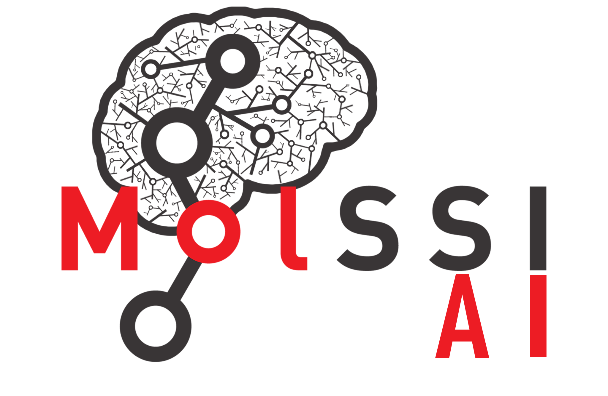

***********************
MolSSI-AI Container Hub 
***********************

Welcome to **MolSSI-AI Container Hub's** documentation.

**MolSSI-AI Container Hub** hosts a collection of curated, free and open-source
Dockerfile and Apptainer (Singularity) image recipes to containarize major open-source 
scientific software and industrial training resources in artificial intelligence,
data science, machine learning and computational molecular science. Our mission is to
to minimize the burden of dealing with the complexities of setting up the scientific
software and managing their dependencies and to boost research productivity and 
reproducibility across all domains of computational molecular sciences.

This package is a part of core infrastructure in the Chem-AI software ecosystem.

.. Table of Contents
.. toctree::
    :maxdepth: 2
    :titlesonly:
    :hidden:

    installation
    quick_start
    contribute
    compchem/index
    general/index
    machine_learning/index
    references
    dev_team
    acknowledgements

.. Grid for Documentation
.. grid:: 1 1 2 2

   .. grid-item-card:: Quick Start
      :margin: 0 3 0 0

      Jump right into using MolSSI-AI Container Hub!

      .. button-link:: ./quick_start.html
        :color: primary
        :expand:

        Quick Start Guide

   .. grid-item-card:: MolSSI-AI Container Hub
      :margin: 0 3 0 0

      MolSSI-AI container recipes for molecular science

      .. button-link:: https://hub.docker.com/u/molssiai
        :color: primary
        :expand:

        MolSSI-AI Recipes

   .. grid-item-card:: Machine Learning
      :margin: 0 3 0 0

      A collection of image recipes for ML software

      .. button-link:: ./machine_learning/index.html
        :color: primary
        :expand:

        API Reference

   .. grid-item-card::  Computational Chemistry
      :margin: 0 3 0 0

      Containers for open-source QC software

      .. button-link:: ./compchem/index.html
        :color: primary
        :expand:

        Developer Guide

.. list-table:: **Stay in Touch**
   :widths: 10 10 10 10
   :header-rows: 1
   :align: center

   * - GitHub
     - MolSSI-AI Hub
     - Zenodo Community
     - MolSSI Guidelines
   * - |GitHub|
     - |MolSSI-AI Hub|
     - |Zenodo|
     - |MolSSI|

.. Badge(s)
.. |GitHub| image:: https://upload.wikimedia.org/wikipedia/commons/9/91/Octicons-mark-github.svg
   :target: https://github.com/molssi-ai/molssi-ai-hub
   :alt: zenopy GitHub Repository
   :width: 90

.. |MolSSI-AI Hub| image:: images/docker.svg
   :target: https://hub.docker.com/u/chemai
   :alt: MolSSI-AI Container Hub
   :width: 110

.. |Zenodo| image:: https://about.zenodo.org/static/img/logos/zenodo-gradient-square.svg
   :target: https://zenodo.org/communities/molssi/
   :alt: MolSSI Zenodo Community
   :width: 150

.. |MolSSI| image:: https://raw.githubusercontent.com/MolSSI/molssi-branding-guidelines/master/logos/main_logo/molssi_main.svg
   :target: https://molssi-ai.github.io/molssi-ai-guidelines/index.html
   :alt: MolSSI Guidelines and Best Practices
   :width: 140
